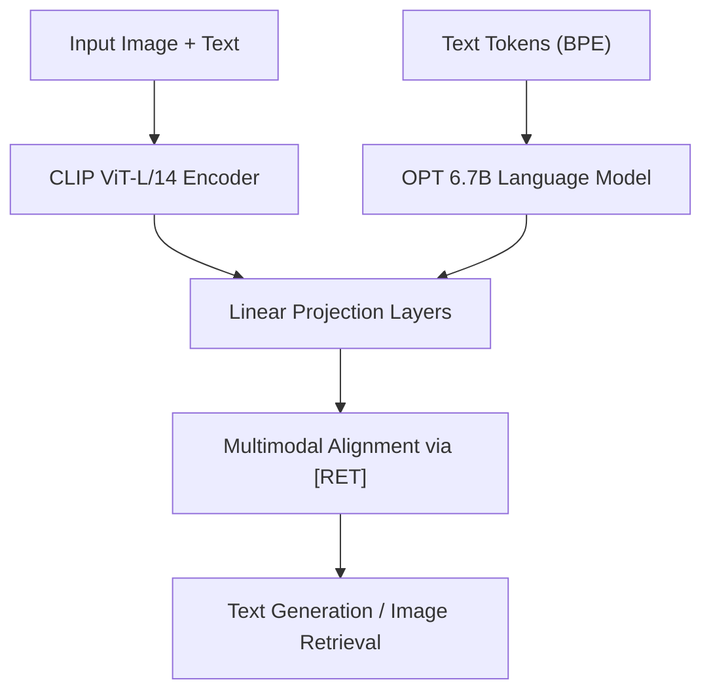

# FROMAGe: Frozen Retrieval Over Multimodal Data for Autoregressive Generation

[](https://creativecommons.org/licenses/by-sa/4.0/)

**FROMAGe** is a lightweight multimodal framework that integrates frozen vision and language backbones with minimal overhead. It introduces a novel `[RET]` token to embed image features into a language stream, enabling high-quality **zero-shot image captioning** and **image–text retrieval**—without backbone fine-tuning.

---

## 🔍 Overview

This project demonstrates a multimodal architecture that processes and generates **interleaved image-text outputs** using:

* A **frozen language model**: Facebook’s OPT-6.7B
* A **frozen vision encoder**: OpenAI’s CLIP ViT-L/14
* Lightweight **trainable projection layers**
* A special `[RET]` token for multimodal alignment

---

## 📌 Key Features

* 🧠 **Zero-shot generalization** without full-model fine-tuning
* 🔄 **Interleaved generation** (text + image retrieval)
* 💡 Lightweight training (\~few million parameters only)
* 💬 **Multimodal dialogue** capabilities in GUI
* 📈 BLEU-4 = 0.1337 (zero-shot), 87.08% captioning accuracy
* 🔍 7.29% retrieval improvement over CLIP baseline

---

### 🏗️ Architecture



* Embeddings from CLIP and OPT are aligned via learnable projection layers.
* A `[RET]` token anchors visual information into the token stream.
* Trained on multitask loss: image captioning (**MLE**) + retrieval (**InfoNCE**).

---

## 📊 Results

| Task                  | Metric    | Score  |
| --------------------- | --------- | ------ |
| Image Captioning      | BLEU-4    | 0.1337 |
| Captioning Accuracy   | Accuracy  | 87.08% |
| Multimodal Retrieval  | Accuracy  | 86.33% |
| Improvement over CLIP | ΔAccuracy | +7.29% |

---

## 🛠 Technologies Used

* Python (PyTorch, Transformers)
* HuggingFace’s `AutoFeatureExtractor`, `OPT-6.7B`
* CLIP ViT-L/14 (OpenAI)
* Byte-Pair Encoding (BPE Tokenizer)
* Mixed-precision training (fp16)
* Evaluation: BLEU, Precision, Recall, F1, Retrieval Accuracy

---

## 🧪 Dataset

**Conceptual Captions (CC3M)**

* \~3.3 million image–text pairs
* Filtered for broken URLs (\~61k used)
* Random snippet fusion with 0.5 probability

🔗 [CC3M Dataset](https://ai.google.com/research/ConceptualCaptions)

---

## 🔧 Installation & Usage

```bash
# Clone the repo
git clone https://github.com/yourusername/fromage-multimodal.git
cd fromage-multimodal

# Install dependencies
pip install -r requirements.txt

# Run the training
python train.py --config=configs/fromage_config.json

# Launch the GUI inference
streamlit run app.py
```

---

## 🧪 Evaluation

```bash
# Run BLEU evaluation
python eval_caption.py --model_path=checkpoints/best_model.pt

# Run image-text retrieval evaluation
python eval_retrieval.py --dataset=cc3m --top_k=5
```

---

## 📦 Project Structure

```
FROMAGe/
├── configs/
│   └── fromage_config.json
├── models/
│   ├── fromage_model.py
│   └── projection_layers.py
├── data/
│   └── cc3m_preprocessed/
├── utils/
│   ├── preprocessing.py
│   ├── metrics.py
├── app.py                  # GUI interface (Streamlit)
├── train.py
├── eval_caption.py
├── eval_retrieval.py
└── README.md
```

---

## 🧠 Authors

* **Dr. Seemanthini K** – [ORCID](https://orcid.org/0000-0003-0020-3695)
* **Vivek Jain** – [Google Scholar](https://scholar.google.com/citations?hl=en&user=K9QjK8EAAA) | [ORCID](https://orcid.org/0009-0009-5004-2050)
* **Ashish D D** – [Google Scholar](https://scholar.google.com/citations?hl=en&user=SqYpvyYAAAAJ) | [ORCID](https://orcid.org/0009-0009-0061-9608)
* **Abhishek S Kerenor** – [Google Scholar](https://scholar.google.com/citations?user=Bykbz7wAAAAJ) | [ORCID](https://orcid.org/0009-0005-3728-0418)

---

## 📜 License

This work is licensed under a [Creative Commons Attribution-ShareAlike 4.0 License](https://creativecommons.org/licenses/by-sa/4.0/).

---

## 📬 Contact

For questions or collaborations, please reach out at:
📧 [vivek.ai20@bmsce.ac.in](mailto:vivek.ai20@bmsce.ac.in) | [seemanthinik.mel@bmsce.ac.in](mailto:seemanthinik.mel@bmsce.ac.in)
